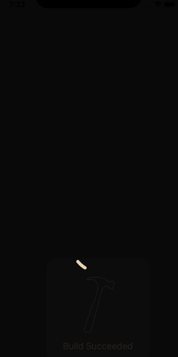

# Curve-Line-Pop-Animation

a curve line animation effect using CALayer and CABasicAnimation

## GIF

## Usage

`createCurvedLine(from: CGPoint.init(x: self.view.frame.midX, y: 600), to: CGPoint.init(x: self.view.frame.midX, y: 200), withDuration: 1.25)`

## Platform

iOS, Swift

## Contact me
https://www.syedaraib.com
